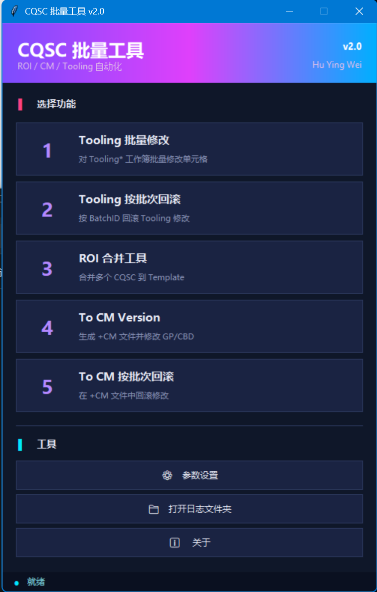

# CQSC 批量工具 v2.0



针对 **CQSC-V33** 模板的 Excel 批量自动化桌面工具。基于 Python + pywin32 驱动本机 Microsoft Excel，无需打开 Excel 界面即可完成批量修改、合并与版本转换，并提供按批次精确回滚能力。

## ✨ 功能一览

| # | 功能 | 说明 |
|---|------|------|
| 1 | **Tooling 批量修改** | 对多个 `Tooling*` 工作簿批量修改单元格，自动写入 `_ChangeLog` 变更日志 Sheet |
| 2 | **Tooling 按批次回滚** | 按 BatchID 精确回滚 Tooling 的历史修改 |
| 3 | **ROI 合并工具** | 将多个 CQSC 工作簿合并到 Template，自动填写 PI 数据 / CONSOLIDATION 单元格 / 截图到 PPT 页，输出 `ROI Combine 日期.xlsx` |
| 4 | **To CM Version** | 一键生成 `+CM` 版本文件，并按系数修改 GP / CBD 相关单元格 |
| 5 | **To CM 按批次回滚** | 在 `+CM` 文件中按批次回滚修改（`_CM_ChangeLog`） |

**通用特性**

- 🔄 所有修改自动记录到隐藏日志 Sheet（`_ChangeLog` / `_CM_ChangeLog`），记录原值 / 新值 / 公式类型 / 数字格式，支持精确回滚
- ⚙️ 全部定位规则（Sheet 前缀、定位单元格、匹配内容、系数等）均可在「参数设置」中可视化配置，无需改代码
- 🌙 深色赛博风 GUI，运行过程实时日志窗口
- 📁 每次运行自动生成带时间戳的运行日志到 `logs/`

## 🖥️ 运行环境

- Windows + 已安装 Microsoft Excel（通过 COM 接口调用）
- Python 3.8+
- 依赖：`pywin32`

## 🚀 安装与启动

```bash
git clone https://github.com/Huyingwei890/CQSC_Tools.git
cd CQSC_Tools

python -m venv .venv
.venv\Scripts\python.exe -m pip install pywin32
```

之后双击 `启动 CQSC 工具.bat`（自动使用项目自带 `.venv`），或：

```bash
.venv\Scripts\python.exe main.py
```

## ⚙️ 配置说明

首次运行会自动从 `settings_default.py` 生成 `settings.json`，之后点击主界面 **「⚙ 参数设置」** 即可可视化编辑所有参数：

| 分区 | 可配置项（部分） |
|------|------------------|
| 通用 | **Excel 打开密码** |
| Tooling 修改 | Sheet 前缀、定位单元格/内容、日志 Sheet 名 |
| ROI 合并 | Template 路径、输出目录、PreCER/PI 定位规则、CONSOLIDATION 填写单元格、PPT 截图区域 |
| To CM Version | GP/CBD 定位规则、M/V 列加权区域与系数、文件后缀 |

> 🔒 **安全说明**：出于敏感信息保护，本仓库**不包含 Excel 打开密码**。克隆后请先在「参数设置 → 通用 → Excel 打开密码」中填入你自己的密码，或直接编辑 `settings.json`。`settings.json` 已在 `.gitignore` 中排除，本地填写的密码不会被提交。

## 📁 目录结构

```
CQSC_Tools/
├── main.py                 主程序入口
├── settings_default.py     默认配置（settings.json 缺失时自动初始化）
├── settings.json           用户配置（首次运行自动生成，不入库）
├── core/                   公共组件（配置管理 / Excel 工具 / 变更日志 / 日志窗口）
├── modules/                功能模块（与主界面 1~5 一一对应）
├── ROI combine Template/   ROI 合并所用的空白 Template
├── logs/                   运行日志（自动生成，不入库）
├── output/                 ROI 合并输出（自动生成，不入库）
└── docs/                   文档图片
```

## 📝 日志与回滚

- 每次运行自动在 `logs/` 留下一份 `日期_时间_模块名.log`，主界面「📁 打开日志文件夹」可直达。
- 工作簿内的 `_ChangeLog` / `_CM_ChangeLog` Sheet 记录每次修改的批次（BatchID）、单元格、原值/新值，对应功能可按批次一键回滚。

## ⚠️ 适用范围

本工具针对 **CQSC-V33** 系列模板（SFP254 Pre-CER / CER 财务评估工作簿）的表格结构定制开发。若模板结构有调整，请在「参数设置」中同步更新各定位单元格。

---

*Author: Hu Ying Wei*
